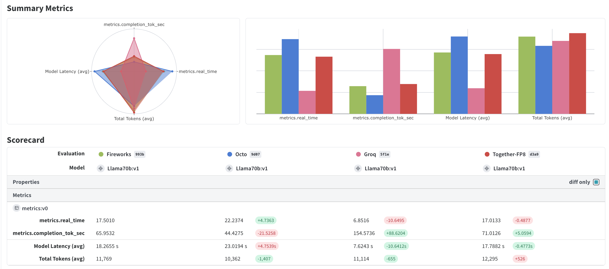

# LLM Benchmark Tool

This tool benchmarks the performance of various Large Language Models (LLMs) across different providers.

## Features

- Supports multiple LLM providers (Octo, Groq, Fireworks, Together)
- Measures real-time performance, prompt tokens per second, and completion tokens per second
- Configurable number of runs and custom prompts
- Uses Weave for evaluation and scoring

## Setup

1. Clone the repository:
   ```
   git clone https://github.com/your-username/llm-benchmark-tool.git
   cd llm-benchmark-tool
   ```

2. Install the required dependencies:
   ```
   pip install -r requirements.txt
   ```

3. Set up environment variables for API keys:
   ```
   export OCTO_API_KEY=your_octo_api_key
   export GROQ_API_KEY=your_groq_api_key
   export FIREWORKS_API_KEY=your_fireworks_api_key
   export TOGETHER_API_KEY=your_together_api_key
   ```

## Usage

Run the benchmark with default settings:

```
python benchmark.py
```

You can also customize the benchmark settings by providing command-line arguments:

```
python benchmark.py --provider <provider_name> --prompt <custom_prompt> --n <num_runs>
```

For example the default settings are (around 1k tokens for llama70b)

```
python benchmark.py --provider fireworks --prompt "Tell me a long story about a cat" --n 10
```

This will run the benchmark with the Fireworks provider, using the prompt "Tell me a joke", and perform 5 runs.

## Visualizing Results

You can visualize the results in Weave:


